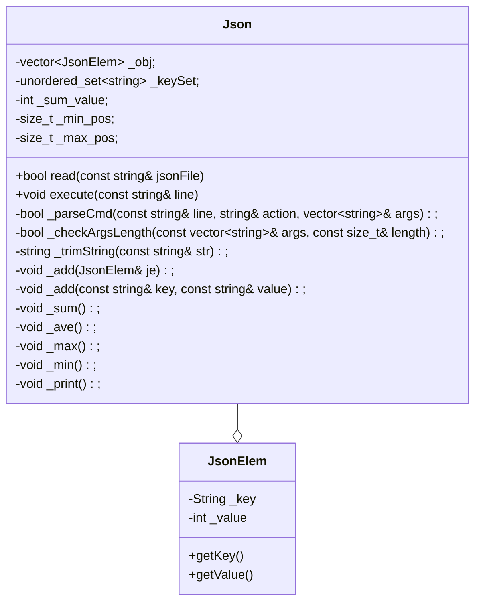
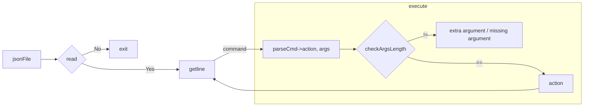
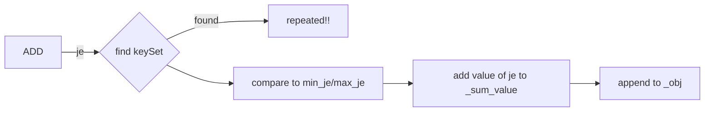

# README  
## p1  
Check about g++ and OS.

## p2  
* Implement a simple JSON reader.
* Implement the following sub-problems:
  * Read .json file.
  * The command `PRINT` prints the entire JSON object.
  * The commands `SUM`, `AVE`, `MAX`, and `MIN` compute the summation, average, maximum, and minimum of the values of different elements in the JSON object.
  * The command `ADD` adds a new element (i.e. key-value pair) to the JSON object.
  * The command `EXIT` exits the program.

### Data structure


### Flow chart


### Test
* unittest: unittest of `ADD`, `SUM`, `AVE`, `MAX`, and `MIN`.
  * dofile: in `./dofile/unittest/*`
* combotest
  * dofile: created by `test.py`
    * count: 100
    * composed(random): `ADD`, `SUM`, `AVE`, `MAX`, and `MIN`.
    * length(random): 10 ~ 1000
    * compared to: `./ref/p2Run-linux`

#### Usage
```shell
$ python3 ./test/test.py
unittest
--------------------------------
add :
  test:  missing_args_0.dofile
    -> pass
  test:  missing_args_1.dofile
    -> pass
  test:  add.dofile
    -> pass

sum :
  ...

ave :
  ...

min :
  ...

max :
  ...

read :
  test:  colon_w_space.dofile
    -> diff!!!
  test:  key_w_space.dofile
    -> diff!!!
  test:  empty_1.dofile
    -> pass
  test:  empty_0.dofile
    -> pass

combotest
--------------------------------
  test 0: 
    -> diff!!!
  test 1: 
    -> pass
  ...
  test 99: 
    -> pass
```
* `pass`: same as output of `./ref/p2Run-linux`
* `diff!!!`: on the contrary
  * store output of `./p2Run`, `./ref/p2Run-linux` and `combo.dofile` in `diff/`

Run the following to check diff. between output of `./p2Run` and `./ref/ p2Run-linux` in `diff/`.
```
$ python3 test/print_combo_test.py
```