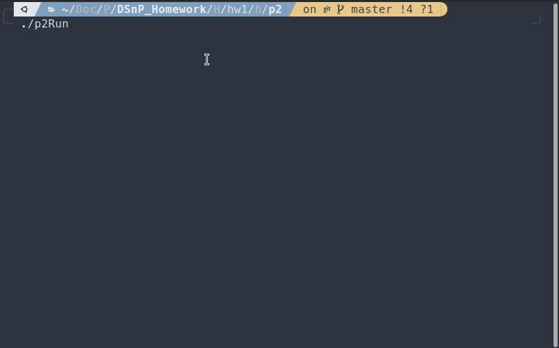

# DSnP-Homework  

HW1    | HW2     | HW3     | HW4     | HW5     | HW6     | HW7     | HW_grade | Final Project | Tmp Grades | Final Grades | Letter Grades
-------|---------|---------|---------|---------|---------|---------|----------|---------------|------------|--------------|--------------
80/100 | 234/250 | 307/380 | 495/500 | 315/510 | 389/520 | 298/450 | 78.15    |         48.7  |      69.32 |         84   |            A-

## hw1  
*more detail, please see [hw1/README](Homework/hw1/README.md).*
* Simple JSON reader CLI.
* Supported Commands
  * `ADD [key] [value]`: adds a new element
  * `SUM`: compute the summation
  * `AVE`: compute the average
  * `MAX`: compute the maximum
  * `MIN`: compute the minimum
  * `PRINT`: prints the entire JSON object
  * `EXIT`: exits the program

## hw2  
*more detail, please see [hw2/README](Homework/hw2/README.md).*
* CLI with the command history
* Supported standard input
  * up/down arrows, PgUp, and PgDn
    * Traverse the command history.
  * left/right arrows, Ctrl-a, Ctrl-e, Home and End
    * Move the cursor.
  * back space, delete
  * Tab

## hw3  
*more detail, please see [hw3/README](Homework/hw3/README.md).*
* Simple DB CLI.
  * Supported Commands
    * `DBAPpend <(string key)><(int value)>` and `DBRead <(string jsonFile)> [-Replace]`
    * `DBCount`, `DBAVerage`, `DBMAx`, `DBMIn` and `DBSUm`
    * `DBPrint [(string key)]`
    * `DBSOrt <-Key | -Value>`
    * `DOfile <(string filename)>`
    * `HELp [(string cmd)]`
    * `HIStory [(int nPrint)]`
    * `Quit [-Force]`

## hw4  
*more detail, please see [hw4/README](Homework/hw4/README.md).*

## hw5  
*more detail, please see [hw5/README](Homework/hw5/README.md).*
* Impletment data structure
  * doubly linked list
  * dynamic array
  * binary search tree

## hw6  
*more detail, please see [hw6/README](Homework/hw6/README.md).*
* Implement a AIG(And-Inverter Graph) reader.
  * Parsing the circuit description file in the AIGER format.
  * Detect serveral types of errors in AIG file.
* Supported Commands
  * `CIRRead <(string fileName)> [-Replace]`
  * `CIRPrint [-Summary|-Netlist|-PI|-PO|-FLoating]`
    * `-Summary`: Print out the circuit statistics.
    * `-Netlist`: List all the gates in the topological (depth-first-search, DFS) order.
  * `CIRGate <<(int gateId)> [<-FANIn|-FANOut><(int level)>]>`
  * `CIRWrite [-Output (string aagFile)]`

## hw7  
*more detail, please see [hw7/README](Homework/hw7/README.md).*